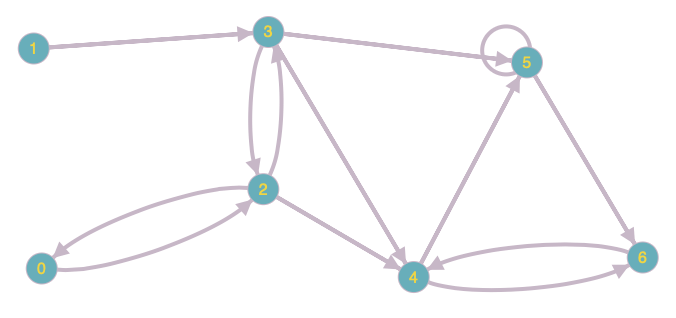

# EECS738_Project04

## Project 4 - Treasure Hunters Inc.
### We do the treasure hunting and monster fighting for you
##### 1. Set up a new git repository in your GitHub account
##### 2. Think up a map-like environment with treasure, obstacles and opponents
##### 3. Choose a programming language (Python, C/C++, Java)
##### 4. Formulate ideas on how reinforcement learning can be used to find treasure efficiently while avoiding obstacles and opponents
##### 5. Build one or more reinforcement policies to model situational assessments, actions and rewards programmatically
##### 6. Document your process and results
##### 7. Commit your source code, documentation and other supporting files to the git repository in GitHub

### Map
In this threasure hunters game, a map-like environment with treasure, obstacle and opponents is provided. Consider a map as following:

where node 4 is "opponent", node 6 is "treasure", and all unavailable paths are considered as obstacles.

Corresponding adjacency matrix is:

###### [[0, 0, 1, 0, 0, 0, 0],
###### [0, 0, 0, 1, 0, 0, 0],
###### [1, 0, 0, 1, 1, 0, 0],
###### [0, 0, 1, 0, 1, 1, 0],
###### [0, 0, 0, 0, 0, 1, 1],
###### [0, 0, 0, 0, 0, 1, 1],
###### [0, 0, 0, 0, 1, 0, 0]]
